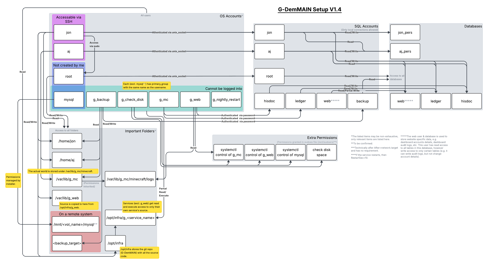

# G-DemMAIN
[](doc/infra-diagram.pdf)

TODO: Build deamon overview table from actual source files

| Service Name       | Description                                                                     | User                | After+Requires | Part Of        | Requires Mount For          | On Calender        | Restart                                   | On Fail        | WorkingDir, ExecStart, ExecStop                                                               | UMask |
|--------------------|---------------------------------------------------------------------------------|---------------------|----------------|----------------|-----------------------------|--------------------|-------------------------------------------|----------------|-----------------------------------------------------------------------------------------------|-------|
| g\_mc              | Runs the Minecraft server jar.                                                  | g\_mc               | mysql          |                |                             |                    | on-failure (max 2 fails in five minutes)  | Send an email. | /var/lib/g\_mc, /opt/infra/g\_mc/start\_service.sh, /opt/infra/g\_mc/start\_service.sh        | 0002  |
| g\_web             | Runs the website / node.js server - home, rules, hisdoc, dynmaps.               | g\_web              | mysql          |                |                             |                    | always                                    | Send an email. | /var/lib/g\_web, /opt/infra/g\_web/start\_service.sh, /opt/infra/g\_web/start\_service.sh     |       |
| mysql              | Manages the databases. Note that this is provided by MariaDB.                   | mysql               |                | g\_web, g\_mc  | /mnt/<vol\_name>/mysql      |                    | no                                        | Send an email. | /var/lib/mysql, (Provided by MariaDB), (Provided by MariaDB)                                  |       |
| g\_backup\_mc      | Backup certain folders from the Minecraft world.                                | g\_backup           |                |                |                             | *-*-01 02:00:00    | no                                        | Send an email. | N/A, /opt/infra/g\_backup/backup\_mc.sh, N/A                                                  |       |
| g\_backup\_home    | Backup the personal homes.                                                      | g\_backup           |                |                |                             | *-*-01 02:00:00    | no                                        | Send an email. | N/A, /opt/infra/g\_backup/backup\_home.sh, N/A                                                |       |
| g\_backup\_db      | Backup the databases.                                                           | g\_backup           |                |                |                             | *-*-01 02:00:00    | no                                        | Send an email. | N/A, /opt/infra/g\_backup/backup\_db.sh, N/A                                                  |       |
| g\_check\_disk     | Check that there is sufficient remaining disk space. If not, disables services. | g\_check\_disk      |                |                |                             | *-*-* *:00/5:00    | no                                        | Send an email. | N/A, /opt/infra/g\_check\_dist/check\_disk.sh, N/A                                            |       |
| g\_nightly\_restart| Restart g\_mc (required) and g\_web (if running) nightly.                       | g\_nightly\_restart |                |                |                             | *-*-* 00:00:00     | no                                        | Send an email. | N/A, /opt/infra/g\_check\_dist/run\_nightly\_restart.sh, N/A                                  |       |

Note: If After+Requires is none then we set `After=network.target` and no `Requires`.
                                       

TODO: Add documentation on use of fail2ban (brute force attacks)  

# Ports
| Port Number   | What is it for?                         | Blocked by the firewall? |
|---------------|-----------------------------------------|--------------------------|
| 25565         | Minecraft Server                        | No                       |
|  3000         | Website  # TODO Make this port 80       | No                       |
|  3001         | Website Websocket                       | No                       |
| 25585         | g_mc_monitor console socket (loopback-only, see [doc](doc/G-DemMAIN%20Monitor%20Mod.md)) | Yes |
| 25586         | g_mc_monitor chat socket (loopback-only, see [doc](doc/G-DemMAIN%20Monitor%20Mod.md)) | Yes |
| 31415         | SSH Access                              | No                       |
|  3306         | MySQL                                   | Yes                      |
| _All others_  |                                         | Yes                      |

# SSH
We connect to the server through SSH. For security passwords are disabled, instead we use a public/private key pair.  
If this is your first time, this is how we can set this up:  
1. Your computer:  
Run `ssh-keygen -t ed25519 -f ~/.ssh/id_ed25519_gdem`.  
This will prompt you to add a passphrase, please use something strong.  
2. Your computer:  
If `~/.ssh/config` doesn't exist then create it. Then append this  
```
Host gdem
    HostName <g-dem_ip>
    Port 31415
    User <user_name>
    IdentityFile ~/.ssh/id_ed25519_gdem
```
3. Server:  
Ensure the file `~/.ssh/authorized_keys` exists. If not create it and run `chmod 700 ~/.ssh` and `chmod 600 ~/.ssh/authorized_keys`.
Then append the line in `~/.ssh/id_ed25519_gdem` (formatted `ssh-ed25519 <your_key> <comment>`) to `~/.ssh/authorized_keys`.
4. Your computer:  
Now you can connect the server using `ssh gdem`.

# SystemD
SystemD is the utility that runs "services". These are basically each program - e.g. minecraft (g\_mc), the database (mysql), the website (g\_web), etc. This allows us to easily run all programs from the same place, configure them to rely on eachother (minecraft needs the database for block logging)), and configure them to restart if they crash.  

To start and stop a service use `systemctl start <service_name>` and `systemctl stop <service_name>`.  
To enable and disable a service use `systemctl enable <service_name>` and `systemctl disable <service_name>`.  
The difference between these two is that enabled means it will start if the VPS restarts, while if we only start it then it won't. Basically if you want to run something then you should enable it, and then start it. And to stop something you should disable and stop it.  

Some services are configured to not restart if they crash too frequently. If you attempt to run a service that has failed too frequently, you will see `Job for <service_name>.service failed because start of the service was attempted too often.`. This message should go away after the configured time, however should you want to start the service sooner, run `systemctl reset-failed <service_name>` and then start the server.  

After the configuration is changed, you will need to run `systemctl daemon-reload`.  

To view the status of a service, run `systemctl status <service_name>`.   
And to view the full logs you can use the journalctl utility. Using `journalctl -f` allows you to see logs as they happen, and by specificying `-u <service_name` you can filter specific services. Use `Ctrl-C` to exit.  
Note: you may need to run this as `sudo` or be in the `systemd-journalctl` group (to add a user run `usermod -a -G systemd-journal <user_name>`).  
You can also use `systemd-analyze verify <service_name>.service` to check for some errors.  


